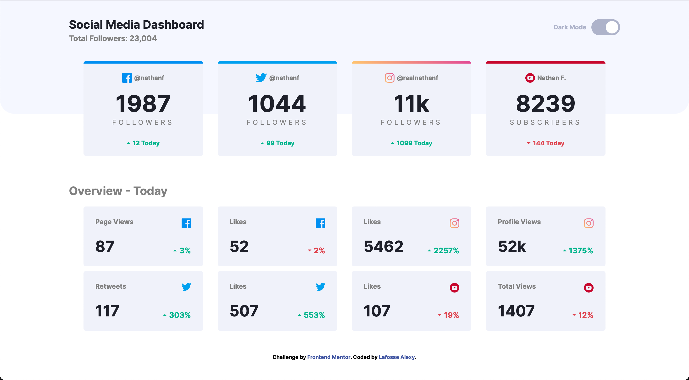
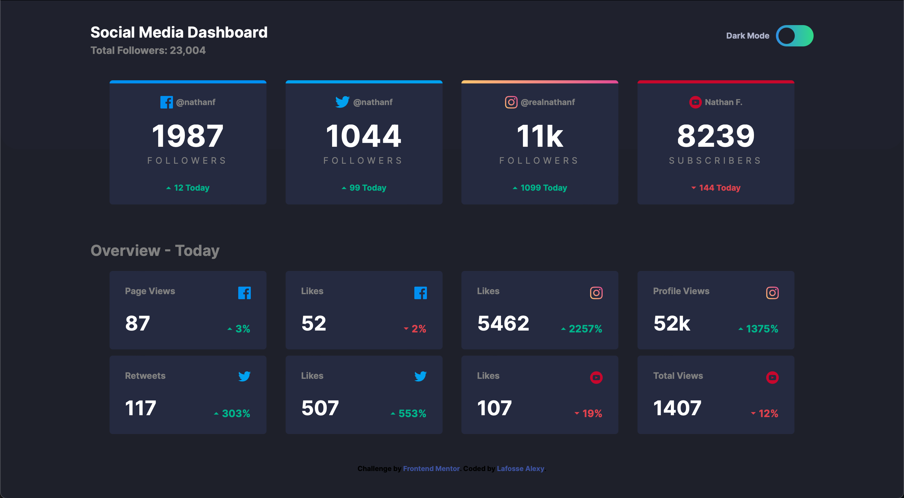
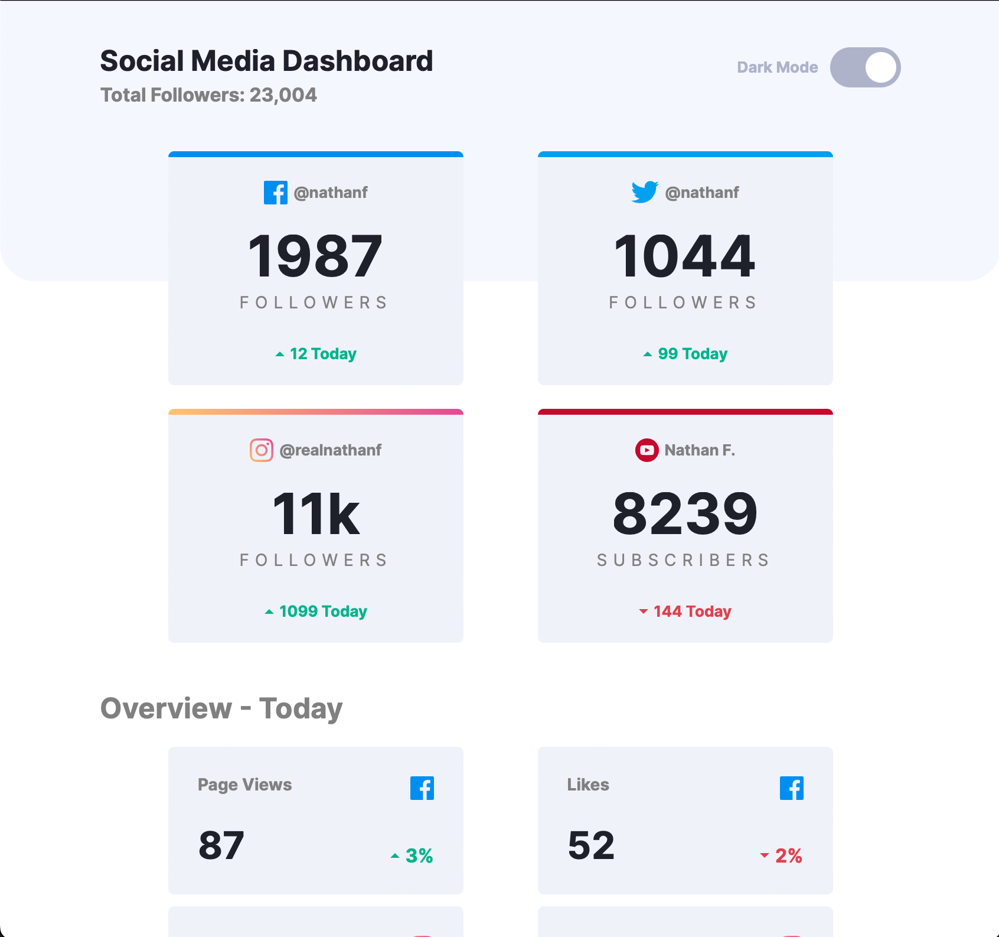
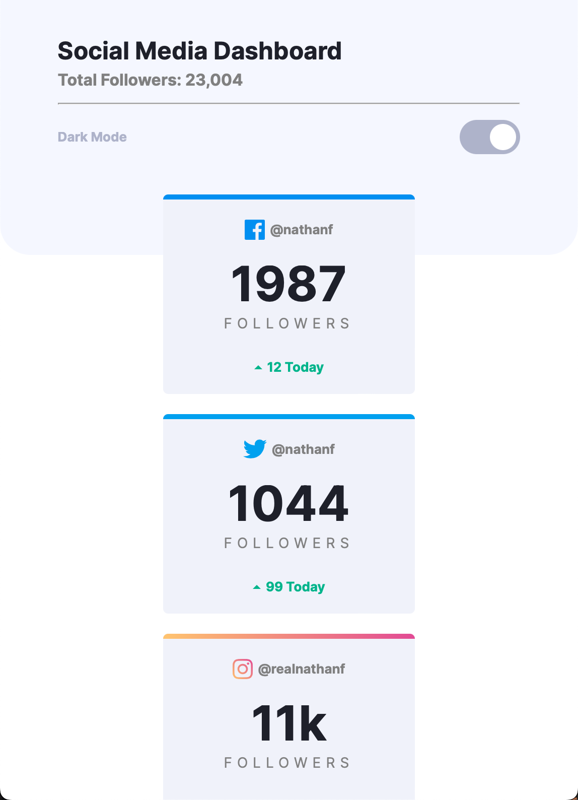

# Frontend Mentor - Social media dashboard with theme switcher solution

This is a solution to the [Social media dashboard with theme switcher challenge on Frontend Mentor](https://www.frontendmentor.io/challenges/social-media-dashboard-with-theme-switcher-6oY8ozp_H). Frontend Mentor challenges help you improve your coding skills by building realistic projects. 

## Table of contents

- [Overview](#overview)
  - [The challenge](#the-challenge)
  - [Screenshot](#screenshot)
- [My process](#my-process)
  - [Built with](#built-with)
  - [What I learned](#what-i-learned)
- [Author](#author)
- [Acknowledgments](#acknowledgments)

## Overview

### The challenge

Users should be able to:

- View the optimal layout for the site depending on their device's screen size
- See hover states for all interactive elements on the page
- Toggle color theme to their preference

### Screenshot

## My process

### Built with

- HTML5
- CSS (Felxbox, ...)
- JS

### What I learned

I learned how to create a toggle, and how to customize it.

I also try to make a good responsive.

## Author

- Frontend Mentor - [@XLA17](https://www.frontendmentor.io/profile/XLA17)
- GitHub - [@XLA17](https://github.com/XLA17/Web_Challenge-2)

## Acknowledgments

Thanks to [Arthur Gillier]() who makes this challenge with me.
